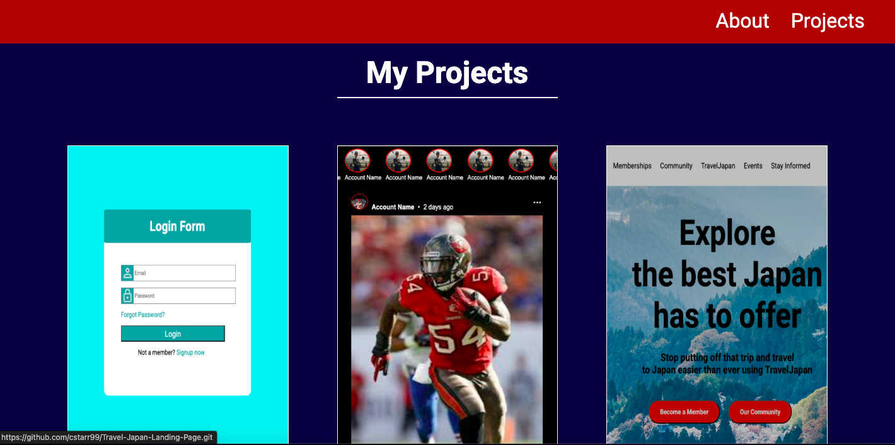

# Portfolio

### This app is my portfolio that hold the projects that I want to showcase. I made this site so that I could have all of my best projects in one place so its easy to find them and easy to find the github for each project.

### I made this site using some design choices from a project I made for a FreeCodeCamp course. I have a sticky header at the top that will allow the user to go to whichever section they want. One the first page is just an about section. The second page is a grid of all of my projects with previews of each project and title underneath. Each box is a clickable link that will take the user to the GitHub repository of each project. And finally, at the bottom of the page there is a _Show All_ button that will take the user to my GitHub home page.

